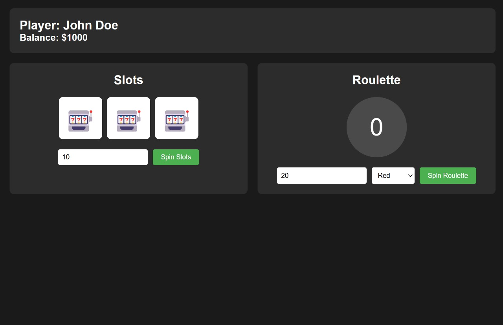

# Casino Games Web Application

A browser-based casino application featuring Slots and Roulette games, built with TypeScript.

## Screenshot



## Features

- 🎰 Slot Machine
  - Multiple symbol combinations
  - Different payout multipliers
  - Animated reel spins

- 🎲 Roulette
  - Bet on red/black
  - Bet on specific numbers
  - Animated number spinner

- 💰 Player Management
  - Balance tracking
  - Transaction history
  - Bet validation
  - Win/loss tracking

## Technologies Used

- **TypeScript** - For type-safe JavaScript development
- **lite-server** - Development server with live reload
- **browser-sync** - Browser synchronization for development
- **ts-node** - TypeScript execution engine
- **ES Modules** - For modular JavaScript code

## Getting Started

### Prerequisites

- Node.js (v14 or higher)
- npm (Node Package Manager)

### Installation

1. Clone the repository:
```bash
git clone <repository-url>
cd casino-games
```

2. Install dependencies:
```bash
npm install
```

3. Build the project:
```bash
npm run build
```

4. Start the development server:
```bash
npm start
```

5. Open your browser and navigate to:
```
http://localhost:3000
```

The server will automatically reload when you make changes to the source files.

## Game Rules

### Slots
- Minimum bet: $1
- Maximum bet: $1,000,000
- Payouts:
  - Triple 7️⃣: 5x
  - Triple 💎: 4x
  - Triple 🎰: 3x
  - Triple 🍒/🍊/🍋: 2x

### Roulette
- Minimum bet: $1
- Maximum bet: $1,000,000
- Payouts:
  - Number (0-36): 35x
  - Red/Black: 2x

## Development

### Project Structure
```
casino-games/
├── src/
│   ├── index.ts        # Game logic and classes
│   └── app.ts          # UI implementation
├── public/
│   ├── index.html      # Main HTML file
│   ├── styles.css      # Styling
│   └── images/
│       └── casinogame.jpg  # Screenshot
├── tsconfig.json       # TypeScript configuration
├── bs-config.json      # Browser-sync configuration
└── package.json        # Project dependencies
```

### Available Scripts

- `npm start`: Compiles TypeScript and starts lite-server with browser-sync
- `npm run build`: Builds the TypeScript files
- `npm run watch`: Watches for file changes and rebuilds

### Development Server Features

- Live reload on file changes
- Automatic browser refresh
- Multiple browser testing
- Network access via external URL
- UI for controlling sync options

## Technical Details

- Built with TypeScript for type safety
- Uses ES6+ features and ES Modules
- Browser-based UI with no framework dependencies
- Modular design for easy expansion
- Development tools:
  - lite-server for serving files
  - browser-sync for development convenience
  - ts-node for TypeScript execution
  - TypeScript compiler for building
