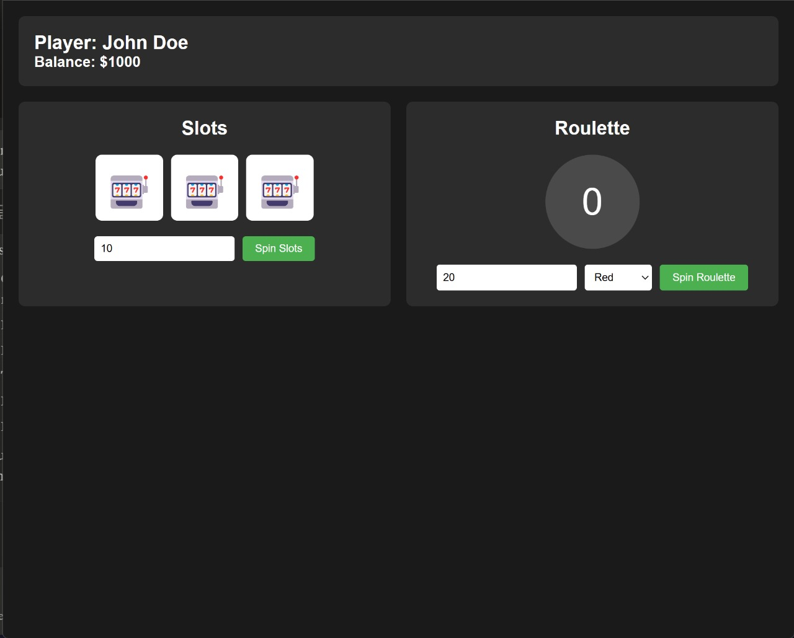

# TypeScript Casino Games

A simple casino implementation featuring slot machines and roulette, built with TypeScript.

## Screenshot



## Features

- Slot machine with different symbol combinations
- European Roulette with standard number layout
- Real-time balance updates
- Animated game results
- Error handling for invalid bets

## Roulette Implementation

### Number Layout

The roulette wheel uses the standard European layout with numbers 0-36:

```
Layout (clockwise):
0 (green)
32-15-19-4-21-2-25-17-34-6-27-13-36-11-30-8-23-10-5-24-16-33-1-20-14-31-9-22-18-29-7-28-12-35-3-26
```

Numbers are divided into three colors:
- **Green**: 0
- **Black**: 2, 4, 6, 8, 10, 11, 13, 15, 17, 20, 22, 24, 26, 28, 29, 31, 33, 35
- **Red**: 1, 3, 5, 7, 9, 12, 14, 16, 18, 19, 21, 23, 25, 27, 30, 32, 34, 36

### Betting Options

1. **Color Bets**
   - Red: Pays 2:1 on red numbers
   - Black: Pays 2:1 on black numbers
   - Zero (green) loses on color bets

2. **Number Bets**
   - Straight up: Bet on any single number (0-36)
   - Pays 35:1 on a win

## Project Setup

1. Install dependencies:
```bash
npm install
```

2. Compile TypeScript:
```bash
tsc
```

3. Run application:
```bash
npm run build
npm start
```

## File Structure

```
casino/
├── src/
│   ├── index.ts       # Core game logic
│   └── app.ts         # UI implementation
├── dist/              # Compiled JavaScript
├── index.html         # Game interface
└── styles.css         # Styling
```

## How to Play

1. **Slots**
   - Enter bet amount
   - Click "Spin Slots"
   - Match 3 symbols to win
   - Different symbols have different payouts

2. **Roulette**
   - Enter bet amount
   - Select bet type (red/black/number)
   - For number bets, enter a number (0-36)
   - Click "Spin Roulette"

## Error Handling

The game implements various safety checks:
- Insufficient funds validation
- Invalid bet amount handling
- Invalid number selection for roulette
- Proper type checking for all inputs

## Browser Support

Tested and working on:
- Chrome 90+
- Firefox 88+
- Safari 14+
- Edge 90+

## Contributing

1. Fork the repository
2. Create your feature branch
3. Commit your changes
4. Push to the branch
5. Create a new Pull Request
